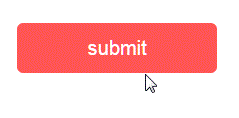

# js-effect-ripple

Material Design Ripple effect in pure JS & CSS.

## Demo

[click me](http://dai-siki.github.io/js-effect-ripple/example/demo.html).


## Screenshot




## Evn
webpack + babel + scss


## Install

#### npm

```shell
$ npm install js-effect-ripple
```


## Usage

```html

<style>
	button {
		position: relative;
		display: block;
		width: 200px;
		height: 50px;
		line-height: 50px;
		margin-bottom: 20px;
		border: none;
		outline: none;
		border-radius: 2px;
		overflow: hidden;
		background-color: #f55;
		color: #fff;
		font-size: 20px;
		cursor: pointer;
		box-shadow: 0 1px 3px 0 rgba(0, 0, 0, 0.15);
	}

	button:hover {
		box-shadow: 0 1px 5px 0 rgba(0, 0, 0, 0.2);
	}

	button:active {
		box-shadow: 0 2px 8px 0 rgba(0, 0, 0, 0.23);
	}

	#btn2 {
		background-color: #fff;
		color: #666;
	}

	#btn3 {
		width: 30px;
		height: 30px;
		line-height: 30px;
		font-size: 18px;
		border-radius: 50%;
		background-color: #fff;
		color: #666;
		overflow: visible;
	}
</style>

<div>
	<button id="btn1" type="button" name="button">submit</button>
	<button id="btn2" type="button" name="button">submit</button>
	<button id="btn3" type="button" name="button">+</button>
</div>

<script>
	import effectRipple from 'js-effect-ripple';

	let btn1 = document.getElementById('btn1'),
		btn2 = document.getElementById('btn2'),
		btn3 = document.getElementById('btn3');

	btn1.addEventListener('click', function (e) {
		effectRipple(e);
	});

	btn2.addEventListener('click', function (e) {
		effectRipple(e,'','#f00');
	});

	btn3.addEventListener('click', function (e) {
		effectRipple(e,'center','#005');
	});
</script>

```
